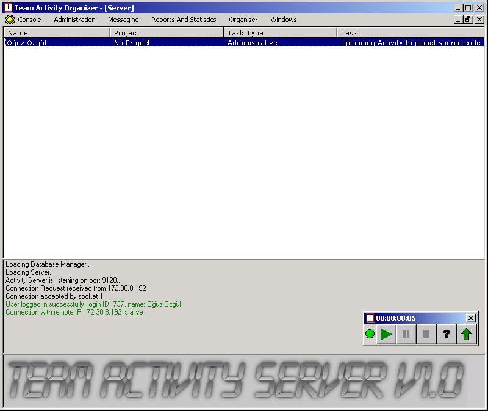



## Activity Logger Client\-Server

### Description

This is a fully functional daily activity storing Client-Server application, which uses MSSQL Server 2000 as the back-end.

We, the developers of VeriPark (One of the leading software companies in Turkey) use this application as our activity logger. Many more features will be added in time.

Please report any bugs/comments, so they will be emailed to me.. (The only developer of the application)

Tested up to 40 simultaneous client connections, with no problem at all..

Uses the client's NT Domain name as the only authentication method, when creating users on the server application, please give them their NT Name as the user name

The Database will be created when first running the server application, the script is in db.sql, you may run it for yourself if you want. If the database exists, no SQL statements will be run on the server.

client.cfg is for clients and tells the client application which server to connect, and by which port

Clients can get their daily reports by clicking the up arrow, and can get their current activity by clicking the question mark, Other button's functionality is obvious : )

The communication is secured by a custom encryption algorithm : )

Easy to use, enjoy, and please give me some marks or at least a feedback : )

Thanks
 
### More Info
 

             |
---                |---
**Submitted On**   |2004-11-26 15:41:00
**By**             |[OGUZ\_OZGUL](https://github.com/Planet-Source-Code/PSCIndex/blob/master/ByAuthor/oguz-ozgul.md)
**Level**          |Advanced
**User Rating**    |5.0 (15 globes from 3 users)
**Compatibility**  |VB 5\.0, VB 6\.0
**Category**       |[Complete Applications](https://github.com/Planet-Source-Code/PSCIndex/blob/master/ByCategory/complete-applications__1-27.md)
**World**          |[Visual Basic](https://github.com/Planet-Source-Code/PSCIndex/blob/master/ByWorld/visual-basic.md)
**Archive File**   |[Activity\_L18345412302004\.zip](https://github.com/Planet-Source-Code/oguz-ozgul-activity-logger-client-server__1-57994/archive/master.zip)

